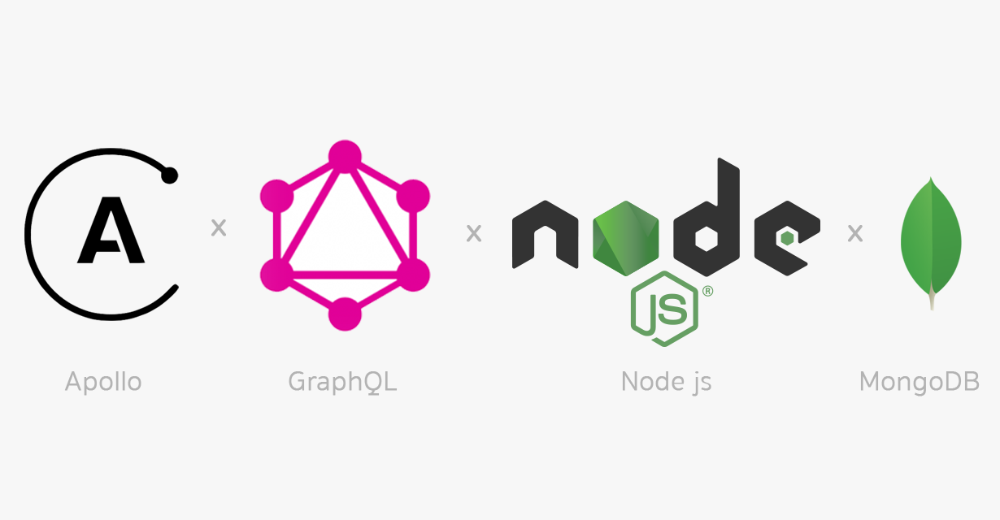
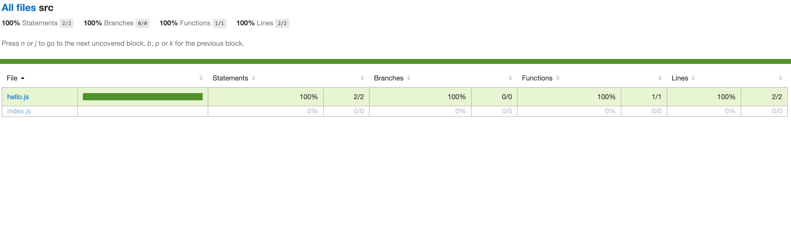

# Attendance API

[](https://img.shields.io/circleci/build/github/michaelbusho/graphql)
[](https://sonarcloud.io/dashboard?id=michaelbusho_graphql)
[](https://github.com/airbnb/javascript)
[](https://sonarcloud.io/dashboard?id=michaelbusho_graphql)
[](https://snyk.io/test/github/michaelbusho/graphql)



#

This project is a simple graphql server. Clients are able to perform CRUD operations. The server stores the data to a mongodb cloud database.

<b>Built with</b>

- [Node](https://nodejs.org/en/)
- [Graphql](https://graphql.org/)
- [Apollo Server](https://www.apollographql.com/)
- [Mongodb](https://www.mongodb.com/)

## Installation

1. [Install Node.js](https://nodejs.org/en/download/)
2. Clone this repo by running

```
git clone https://github.com/michaelbusho/graphql.git
```

3. Navigate into the newly cloned repo and install Node packages by running

```
npm install
```

4. Create a file, named nodemon.json on the root folder and structure it like the nodemon_example.json. Then fill in the required env values.

|                |                                                          |
| -------------- | -------------------------------------------------------- |
| PORT           | Port Where the server should run                         |
| MONGO_USER     | Mongodb Atlas Username                                   |
| MONGO_PASSWORD | Mongodb Atlas Password                                   |
| MONGO_DATABASE | Mongodb Atlas Database Name                              |
| HASH_SALT      | Integer to denote number of salt when hashing a password |
| JWT_KEY        | JWT key to sign jwt tokens                               |
| TOKEN_LIFE     | How long should each jwt token live                      |
|                |                                                          |

5. Run server on watch mode

```
npm run start:demon
```

<sup>\* You will need to create a [mongo db cloud atlas account](https://www.mongodb.com/cloud/atlas) and generate the credentials</sup>

## API Reference

The API offers graphql queries and mutations for 3 different models. Users, Locations and Appearances.

### Users:

```graphql
type User {
	_id: ID!
	rfid: String!
	role: Roles!
	permissions: [String!]!
	email: String!
	password: String
	name: String!
	lastName: String!
	health_status: HealthStatus!
	address: String
	phone_number: String
	image: String
}
```

User Queries:

```graphql
findUserByRfid(rfid: String!): User!
users: [User]!
login(email: String!, password: String!): AuthData!
```

User Mutations:

```graphql
createUser(UserInput: UserInput): User
updateUser(userID: ID!, UserInput: UserInputUpdate): User
deleteUser(userID: ID!): User
```

### Locations:

```graphql
type Location {
	_id: ID!
	name: String!
	capacity: Int!
	address: String
	phone_number: String
	email: String
	description: String
}
```

Location Queries:

```graphql
locations: [Location]
findLocationById(location_id: String!): Location
```

Location Mutations:

```graphql
createLocation(LocationInput: LocationInput): Location
updateLocation(locationID: ID!, LocationInput: LocationInputUpdate): Location
deleteLocation(locationID: ID!): Location
```

### Appearances:

```graphql
type Appearance {
	_id: ID!
	location: Location!
	user: User!
	createdAt: String
}
```

Appearance Queries:

```graphql
findUserAppearances(user_id: String!): [Appearance]
findLocationAppearances(location_id: String!): [Appearance]
```

Appearance Mutations:

```graphql
createAppearance(user_id: String!, location_id: String!): Appearance
deleteAppearance(appearanceID: ID!): Appearance
```

The requests are authenticated and certain actions/requests are restricted and available only to authorized user roles. The API uses a JWT token to achieve this. The query login() returns a valid JWT token upon authentication. The token is valid for a predefined lifespan.

User passwords are hashed using bcrypt.

## Tests



Unit tests are performed using cypress. To run the unit tests and generate test coverage reports simply run

```
npm test
```

The terminal will show the results of the tests. The folder cypress/coverage contains the coverage reports. Simply open cypress/coverage/Icov-report/index.html in a browser. To run the tests in a cypress browser run

```
npm run test:browser
```

If you are using vscode and you wish to run the server on debug mode create a launch.json file inside the .vscode folder and structure it like the launch_sample.json. The env variables should be the same as in the nodemon.json.

## How to use?

If people like your project they’ll want to learn how they can use it. To do so include step by step guide to use your project.

Postman, browser or requests through code

## Credits

Give proper credits. This could be a link to any repo which inspired you to build this project, any blogposts or links to people who contrbuted in this project.

#### VSCODE plugins

- ESLint
- Gitlens
- Graphql for vscode
- live server
- prettier
- vscode-icons

## License

A short snippet describing the license (MIT, Apache etc)

MIT © [Yourname]()
